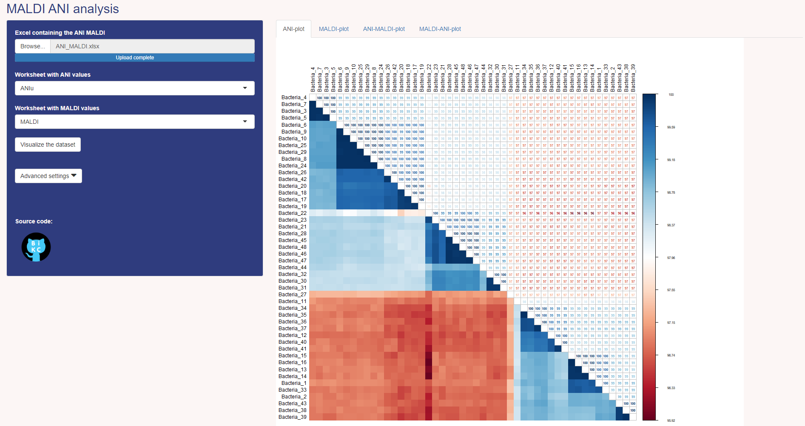
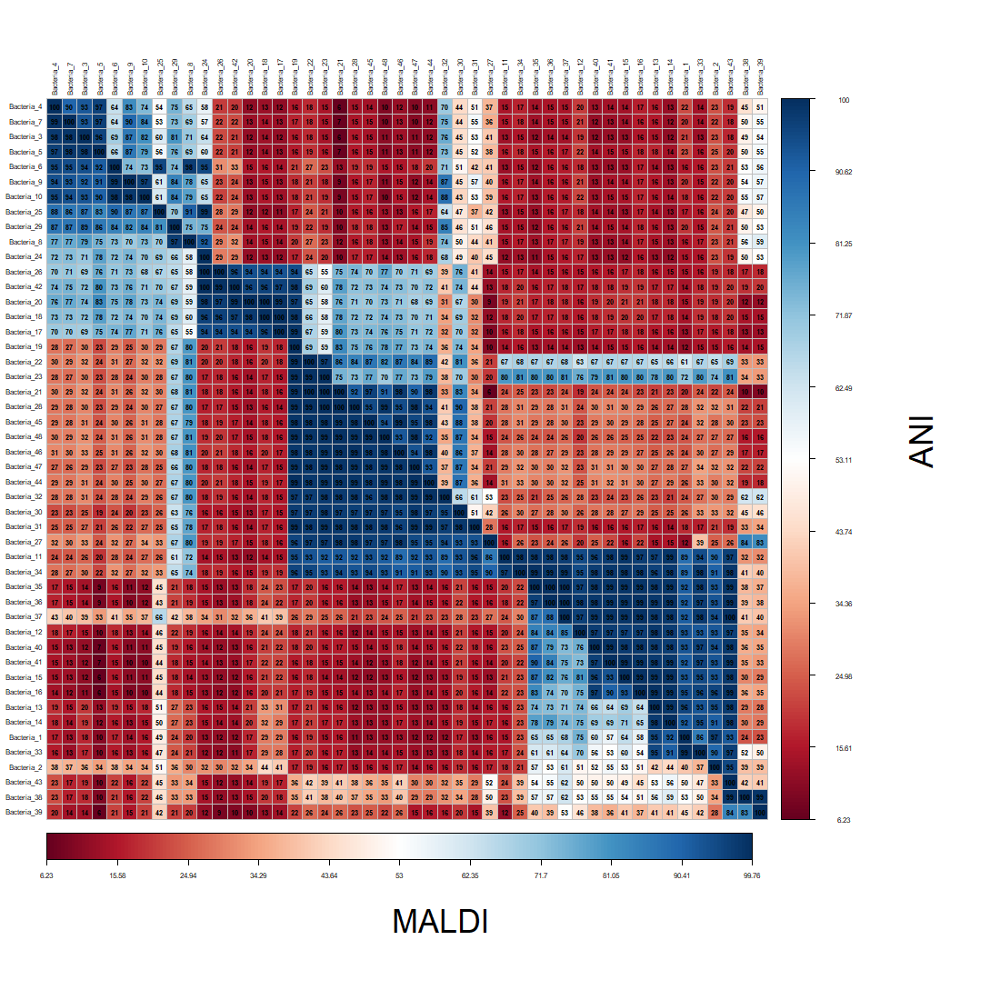
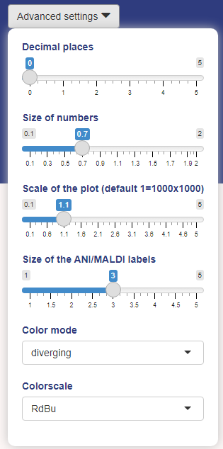
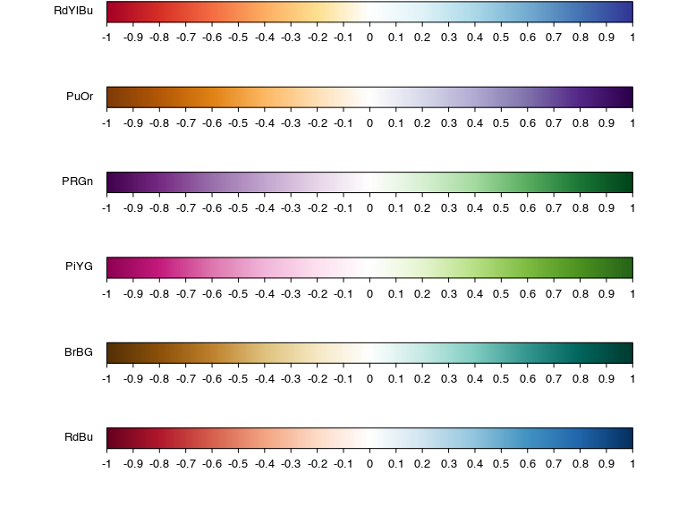
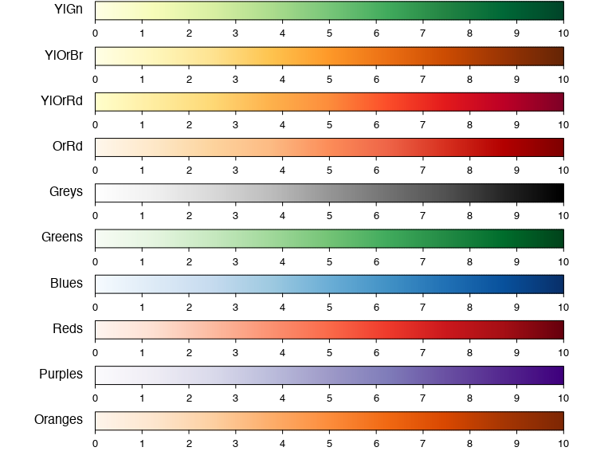

# MAniR
MAniR is an R shiny app that visualizes the results from an ANI analysis as well as the results from MALDI analysis.

ANI analysis is a method to determine the relatedness of bacterial strains. The method is based on the analysis of the genome of the bacteria. The genome is divided into fragments and the similarity of the fragments is determined.

MALDI analysis is a method to determine the presence of bacteria in a sample. The method is based on the analysis of the proteins of the bacteria. The proteins are separated by mass and the mass of the proteins is determined. These can also be compared between each other to determine the relatedness of the bacteria.

MAniR is a tool to visualize the results from both the ANI and MALDI analysis. The tool is based on the R shiny framework. The tool can be used to visualize the results from the analysis of a single sample or multiple samples by way of correlation plots.

### Example of the MAniR app, ANI output


### Example of ANI-MALDI output


## Installation
MAniR can be installed by cloning this repository and running the following command in the root directory of the repository:

```r
R -e "shiny::runApp()"
```

## Usage
The input should be provided in the form of an xlsx file. The file should contain the data in the following format:
_|_bacteria1_|_bacteria2_|_bacteria3_|_bacteria4_|_bacteria5_|
|---|---|---|---|---|---|
|_bacteria1_|_100_|_98.5_|_97.5_|_96.5_|_95.5_|
|_bacteria2_|_98.5_|_100_|_98.5_|_97.5_|_96.5_|
|_bacteria3_|_97.5_|_98.5_|_100_|_98.5_|_97.5_|
|_bacteria4_|_96.5_|_97.5_|_98.5_|_100_|_98.5_|
|_bacteria5_|_95.5_|_96.5_|_97.5_|_98.5_|_100_|

*Note that the diagonal of the matrix should contain the values 100. The values in the matrix should be the ANI values between the bacteria. The values should be between 0 and 100. There should be as many rows and columns as there are bacteria in the sample. The bacteria should be named in the first row and column.*

If you want to perform a combined visualization of the ANI and MALDI analysis, you should make sure that the bacteria are named the same in the ANI and MALDI data and all bacteria are present in both datasets.

## Options
The following options can be set in the app:
* **Worksheet with ANI values**: The worksheet in the xlsx file that contains the ANI values. When an excel file is loaded, the worksheets in the file are listed in the dropdown menu.
* **Worksheet with MALDI values**: The worksheet in the xlsx file that contains the MALDI values. When an excel file is loaded, the worksheets in the file are listed in the dropdown menu.

-- advanced options --


* **Decimal places**: The number of decimal places to show in the correlation plot.
* **Size of numbers**: The size of the numbers in the correlation plot.
* **Scale of the plot**: The scale of the plot, this will make the plot larger or smaller. The default value of 1 means that the output plots will be 1000 by 1000 pixels.
* **Size of the ANI/MALDI labels**: The size of the ANI/MALDI labels in the combined correlation plot.
* **Color mode**: The color mode of the correlation plot. The default value is 'diverging', the other option is 'sequential'. 
* **Colorscale**: Based on the color mode, different color pallets can be selected. The default value is 'RdBu' for the 'diverging' color mode and 'YlOrRd' for the 'sequential' color mode.

### Diverging color pallets:

### Sequential color pallets:


