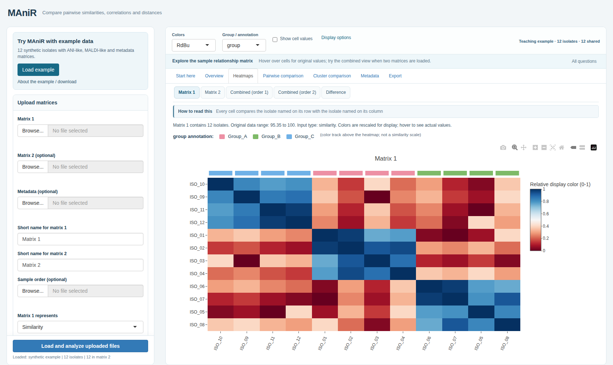
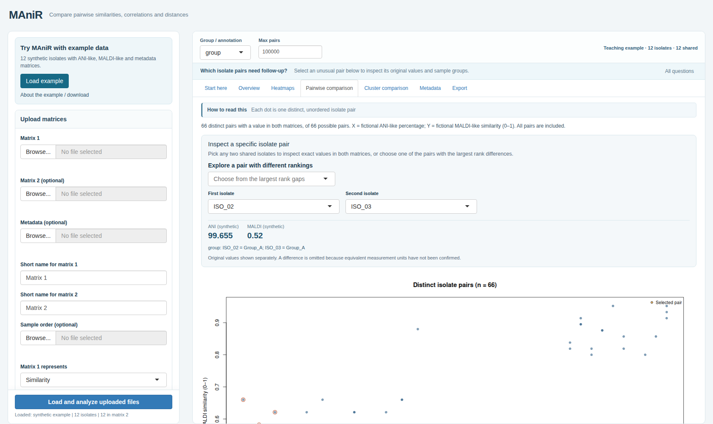
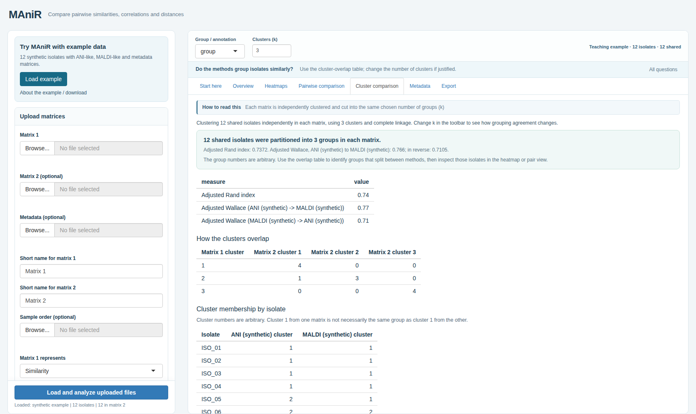
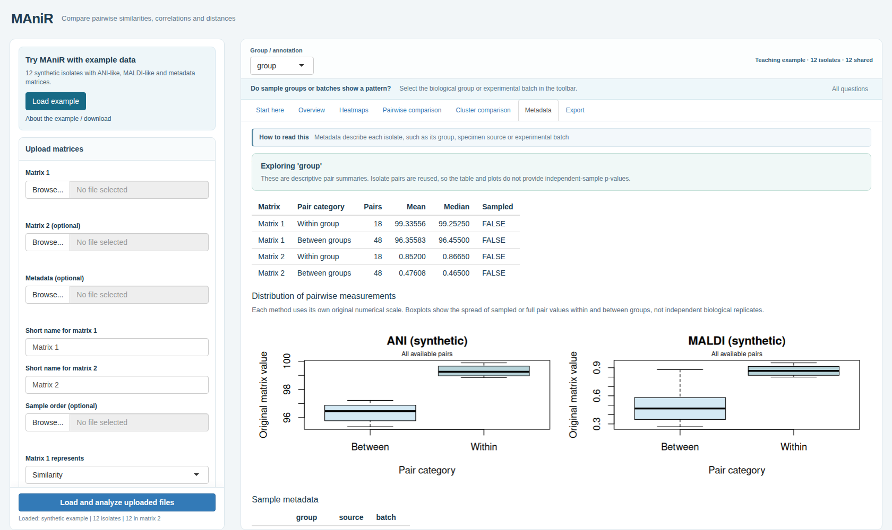

# MAniR

**Interactive comparison of pairwise similarity matrices for MALDI-TOF and genomics.**

MAniR is an R Shiny application for investigating pairwise relationships between bacterial isolates, or other samples for which symmetric pairwise matrices are available. It began as an ANI-versus-MALDI comparison application. The upgrade adds numerical matrix comparison, cluster concordance, a large-dataset raster viewer, metadata annotations, and reusable analysis functions.

This development branch is **MAniR 3.0 prerelease**. The historical application remains available in the repository's Git history and on `main` until the upgrade is reviewed. Do not cite an unverified performance improvement: the benchmark scripts need to be run on specified hardware.

**Start with your research question.** After loading data, the first screen
offers five practical routes: compare methods, inspect unusual isolate pairs,
compare clusters, explore known groups/batches, or inspect a matrix. You do
not need to pick a statistic before you know what you are looking for. See the
[step-by-step research walkthrough](docs/RESEARCH_WORKFLOWS.md) for an
example and suggested next steps.

For help understanding the plots, correlations, directional cluster agreement,
rank gaps, metadata tracks and the restrictions on difference maps, see
[Reading MAniR results](docs/INTERPRETING_RESULTS.md). The application also
displays a short explanation directly on each analysis tab.

## See the actual interface

These screenshots are captured from a running copy of MAniR with the bundled
**synthetic example**. They show the real Shiny controls and output, rather
than design illustrations. The [research walkthrough](docs/RESEARCH_WORKFLOWS.md)
has a screenshot for each step.


*The Start here page: load data, then choose the question you want to answer.*

| Explore sample relationships | Investigate discordant isolate pairs |
| --- | --- |
|  |  |

| Compare cluster assignments | Explore groups and batches |
| --- | --- |
|  |  |

*Screens are recorded at 1680 × 1000 using the synthetic example. Layout and
colors may differ at other window sizes or after you adjust settings.*

## Installation

Install R 4.2 or later. The upload limit defaults to 1,024 MB and can be configured with the `MANIR_MAX_UPLOAD_MB` environment variable. Plan available RAM for at least the uploaded matrices plus working data, especially for two 10,000-isolate matrices. For those larger projects, RDS or CSV is preferable to Excel. In the repository directory, run:

```r
install.packages(c("shiny", "plotly", "htmltools", "htmlwidgets",
                   "openxlsx", "RColorBrewer"))
# Optional accelerators (recommended for large datasets):
install.packages(c("data.table", "fastcluster"))
shiny::runApp(".")
```

For scripted validation, run `Rscript tests/run_tests.R`. For repeatable performance measurements, run `Rscript benchmarks/benchmark.R` and retain the generated CSV. To compare representative original and new plotting pipelines, install the optional `corrplot` and `heatmaply` packages and run `Rscript benchmarks/compare_original.R`. The optional `--smoke` flag runs a short check; `--large` includes 10,000-isolate data and requires substantial RAM.

## Built-in example

Click **Load example** in the application sidebar to explore MAniR
without uploading anything. The example contains 12 **fictional** isolates in
three groups, with two precomputed symmetric similarity matrices:

- **ANI:** synthetic percentage-like genomic similarity (100 on the diagonal).
- **MALDI:** synthetic spectral similarity on a 0–1 scale (1 on the diagonal).
- **Metadata:** fictional group, specimen source and measurement batch.

Two isolate pairs have intentionally discordant MALDI and ANI relationships,
making the example useful for exploring split-triangle views, clustering,
pairwise scatterplots, discrepancies and metadata tracks. The measurement
scales are different, so leave "Both matrices use comparable numerical units"
unchecked. All entries are illustrative and must not be used for biological
inference or cited as measured data.

Open **About the example / download** and click **Example workbook (.xlsx)** to obtain a workbook with `ANI`, `MALDI`,
`metadata` and `README` sheets. The equivalent editable CSV files are in
`examples/`. To upload the workbook yourself, select ANI as the first sheet,
MALDI as the second and metadata as the annotation sheet.

## Workspace layout

On a desktop window, MAniR keeps the analysis results and control sidebar in
**separately scrollable panes**. The lower-left **Load and analyze uploaded
files** button stays visible when you scroll through the upload options.
The right-hand toolbar remains visible when you scroll through a result.

After you load data, MAniR opens **Start here**, where you choose a research question. Choosing **Explore heatmaps** opens **Heatmaps → Matrix 1**.
The primary navigation groups all five heatmap views under **Heatmaps**, with
a compact secondary menu for Matrix 1, Matrix 2, both combined orderings
and Difference. Other tabs are Overview, Pairwise comparison, Cluster
comparison, Metadata and Export.

Use the right-hand **Colors**, **Annotation**, and **Show cell values** controls
for instant plot changes without re-importing the dataset. The palette and
cell-value options appear only in Heatmaps. **Display options** contains log
color scaling and region zoom for large matrices. The **Clusters (k)** control
appears in Cluster comparison, the **Max pairs** control appears in Pairwise
comparison, and **Run Mantel test** appears in Overview. Matrix type, clustering linkage and sample matching are
load-time analysis settings and remain under the left-hand **Analysis settings**
section. Changes to those settings take effect after clicking **Load and
analyze uploaded files**. Help text is collapsed to one line above plots so the
visualization is visible immediately; expand it for more detailed
interpretation.

On small screens or short windows, MAniR switches to a normal scrolling page
rather than forcing two narrow, separately scrolling panes.

## Input formats

- **XLSX / XLSM:** one matrix per worksheet, with sample IDs in the first row and first column. Optional second matrix and metadata sheets may be selected from the same workbook. A second workbook is also supported.
- **CSV / TSV / gzip-compressed CSV or TSV:** sample IDs in the first column, sample names in the header, and numeric pairwise measurements in the remaining cells. A second matrix and metadata may be uploaded separately.
- **RDS:** an R numeric matrix or data frame with row and column sample IDs.
- **Metadata:** a separate Excel worksheet, CSV, TSV or RDS table with sample IDs as row names (or the first column for a text file). Categorical metadata can be displayed as a color strip for large raster views and used for descriptive within-group versus between-group comparisons.
- **Precomputed sample order:** optional plain-text file listing one isolate ID per line. Any remaining isolates are appended in their original order. This avoids recomputing clustering for larger projects.

Every matrix must be square, numeric and symmetric; row and column IDs must be identical as sets. The importer trims outer whitespace and automatically aligns rows to column order. Duplicate identifiers, infinite values, invalid matrix ranges, asymmetric entries and asymmetric missingness are reported. Missing matrix pairs may be imported for visualization, but cannot be used in the Mantel permutation test.

Select what each matrix means: similarity (nonnegative; larger is more similar), correlation (range -1 to 1) or distance (nonnegative; smaller is more similar). "Unspecified" permits a general numeric symmetric matrix and interprets larger entries as more similar when clustering.

For two matrices, choose whether the isolate lists must match exactly or whether to compare their shared intersection. Unmatched isolates remain available in the individual matrix tabs and are reported in the overview.

## Visualization and large-matrix handling

Smaller matrices (300 isolates or fewer) are displayed as interactive Plotly heatmaps with exact hover values. Number overlays are available for at most 70 isolates. For larger matrices, the default raster viewer displays up to 512 representative rows and columns rather than creating a browser annotation for every cell. This is a **representative overview**, not an aggregated matrix or a numerical substitute for the source data. Click a displayed cell to inspect the exact underlying matrix entry.

Open **Display options** in the Heatmaps toolbar, enable **Zoom into large matrices**, and enter the first isolate index and the region size to inspect adjacent samples. When a region exceeds 512 isolates, it is itself reduced to a representative 512-by-512 display; choose a smaller region to inspect every cell.

The combined views use the first matrix above the diagonal and the second below the diagonal. One view uses the sample ordering from matrix 1; the other uses the ordering from matrix 2. Because ANI percentages and MALDI similarities can have different units, **each triangle is display-scaled independently**. Hover and click inspections, pairwise exports and RDS downloads retain the original numeric values. Log display scaling uses log(1+x) on nonnegative values (including a zero diagonal); negative correlations cannot be logarithmically displayed.

Clustering defaults to complete-linkage hierarchical clustering, matching the original corrplot linkage default. Large matrices above 2,000 isolates skip clustering by default to avoid excessive computation and memory use. Supply a precomputed ordering if desired. The original numerical matrices are not altered by clustering.

## Research features

The pairwise comparison tab plots values from corresponding unordered isolate pairs, excluding the diagonal. It reports Pearson and Spearman correlation coefficients. If the matrices truly use comparable units and the corresponding checkbox is enabled, it also reports mean absolute and root mean squared differences, a one-to-one reference line and the isolate pairs with the largest absolute differences. Treat these statistics as descriptive; isolate-pair observations are not statistically independent.

To bound memory use, the pairwise tool examines up to 100,000 distinct pairs by default. When the full dataset exceeds this limit, it selects a reproducible random subset (fixed seed 1), discloses the number of evaluated pairs and marks the analysis as sampled. Downloaded pairwise values follow the same selection. Change **Max pairs** in the Pairwise comparison toolbar for a larger subset.

The Mantel test permutes isolate labels jointly in one matrix. It reports a two-sided permutation p-value using `(extreme + 1) / (permutations + 1)`. The current implementation requires complete matched matrices with at most 400 isolates. The Mantel statistic measures matrix association; it does not establish that two typing methods produce equivalent classifications.

Cluster comparison creates the selected-linkage group assignments on shared isolates and reports the adjusted Rand index and the directional adjusted Wallace coefficients. The number of clusters is user-selectable and both matrices must have at most 2,000 shared isolates. Pairwise similarities and clustering distances are kept conceptually distinct. The metadata group summary describes within-group versus between-group pairwise values, which may be helpful for MALDI repeatability or batch studies. That descriptive group comparison is not a formal batch-effect test.

MAniR accepts **precomputed** MALDI-TOF, ANI, dDDH and other pairwise results. Raw peak detection, spectral calibration and alignment remain the responsibility of specialized preprocessing software. Feeding differently normalized matrices into MAniR does not make the underlying measurement scales interchangeable.

## Export and reproducibility

The Export tab also provides an editable Markdown research summary with optional researcher notes, group summaries and explicitly requested cluster statistics. It does not run expensive permutation tests automatically. The export tab provides exact input matrices as CSV, an RDS bundle containing both matrices, optional metadata and sample order, static PNG, PDF and SVG files, a standalone interactive HTML preview and a text manifest of analysis settings and R session information. Pairwise comparison and cluster assignments have their own CSV exports. PDF and SVG contain individual vector cells for matrices with at most 150 isolates and a representative raster for larger inputs. Interactive HTML previews include at most 300 isolates and require Pandoc for self-contained HTML. Large-image exports use representative raster views with up to 1,200 rows and columns, not an exact full-resolution image of a 10,000-isolate matrix. Exact difference matrices can be exported as CSV when both datasets have comparable numerical units.

To use MAniR reproducibly, archive the source matrices, the metadata, the settings manifest, the installed R package versions, the generated plots and the resulting tables. Never infer a biological cutoff from the normalized heatmap colors; inspect the original numeric values and justify cutoffs from the relevant study.

## Project structure

```text
app.R                 Shiny entry point
ui.R                  Shiny controls, linked views and downloads
server.R              Session-specific upload, analysis and lazy render logic
R/matrix_io.R         Format readers, sample ID validation and alignment
R/matrix_analysis.R   Pairwise summaries, clustering, permutations
R/matrix_plot.R       Interactive and sampled raster rendering
R/example_data.R      Example loading and XLSX download generation
examples/             Synthetic ANI, MALDI and metadata CSVs
tests/run_tests.R     Numeric, import, statistics and rendering regressions
benchmarks/benchmark.R  Repeated staged scaling measurements
docs/UPGRADE_WORKLOG.md Implementation scope and release criteria
.github/workflows/r-tests.yml  Linux and Windows checks
```

## Existing use

MAniR was used to visualize genomic similarity comparisons in Versmessen et al. (2024), *Diagnostics*, 14, 1800, ["Average Nucleotide Identity and Digital DNA-DNA Hybridization Analysis Following PromethION Nanopore-Based Whole Genome Sequencing Allows for Accurate Prokaryotic Typing"](https://doi.org/10.3390/diagnostics14161800). The original tool was designed for ANI and MALDI analyses and later generalized to symmetric pairwise data.

## License

GPL-3.0, as in the original repository.
